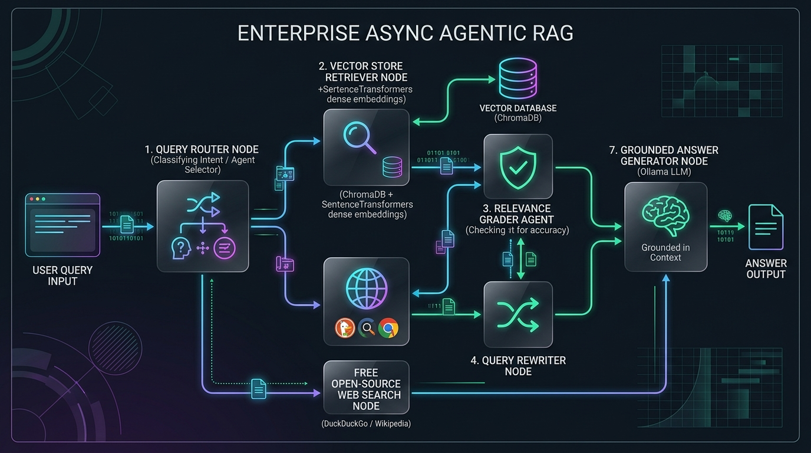
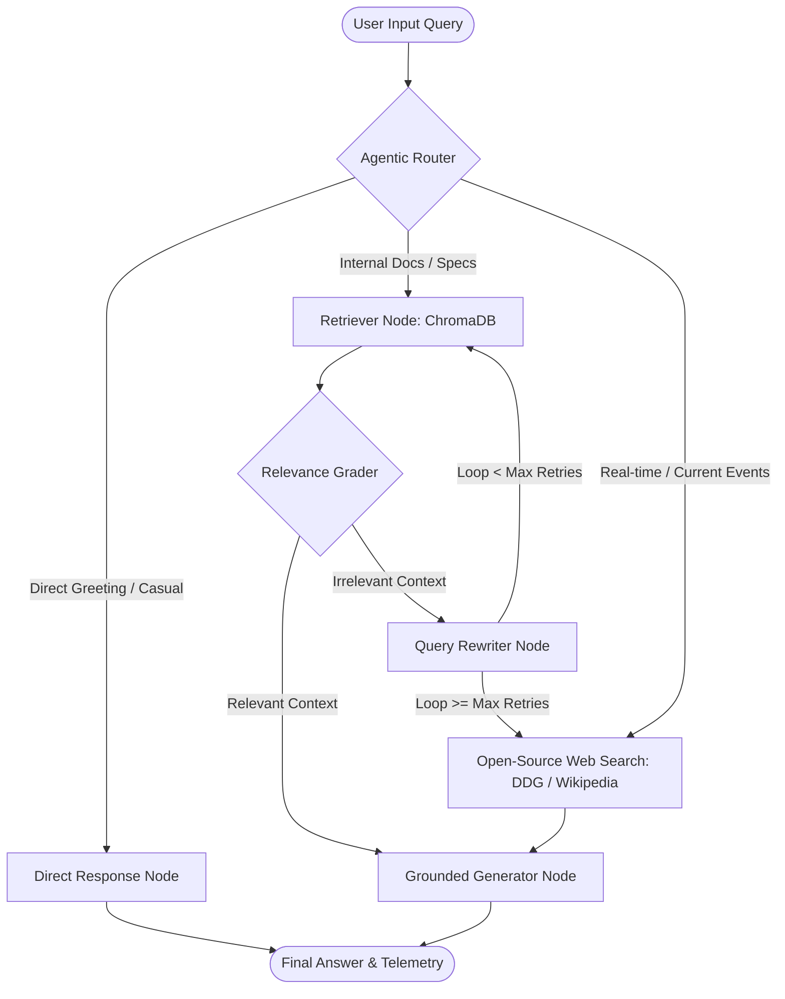

# ⚡ Enterprise RAG
> **100% Free, Open-Source, and Self-Hosted Retrieval-Augmented Generation Architecture**

[](https://www.python.org/)
[](https://fastapi.tiangolo.com/)
[](https://langchain-ai.github.io/langgraph/)
[](https://ollama.com/)
[](https://www.trychroma.com/)
[](https://opensource.org/licenses/MIT)

---

## 📖 Overview

This project is an **Enterprise-Grade Asynchronous Agentic RAG (Retrieval-Augmented Generation)** service engineered with **100% Free and Open-Source software**. It utilizes **LangGraph** to build self-correcting agentic workflows with iterative query rewriting, relevance grading, grounded answer generation, real-time open web search fallback, and comprehensive telemetry metrics.

**Zero paid API subscriptions or proprietary keys are required.**

### 🏛️ System Architecture & Working Flow





---

## ✨ Key Highlights & Features

- 🆓 **100% Free & Open-Source Stack**:
  - **LLM Engine**: Local execution via [Ollama](https://ollama.com/) (`llama3.2:latest`, `qwen2.5:7b`, `mistral`, etc.) with `langchain-ollama`.
  - **Dense Embeddings**: Local [SentenceTransformers](https://www.sbert.net/) (`all-MiniLM-L6-v2`) generating 384-dimensional dense vectors with zero token cost.
  - **Vector Database**: [ChromaDB](https://www.trychroma.com/) with native local persistence and Docker support.
  - **Free Web Search**: [DuckDuckGo Search](https://duckduckgo.com/) (`ddgs`) and [Wikipedia](https://www.wikipedia.org/) search integration.
- 🔄 **Self-Correcting Agentic Loops**:
  - Automatically evaluates retrieved document relevance using a structured grading agent.
  - Dynamically rewrites semantic search queries if relevance thresholds fail.
  - Escalates to live open web search when internal retrieval iterations exceed configured limits.
- ⚡ **Asynchronous FastAPI Serving Layer**:
  - Non-blocking I/O with worker thread pools for vector operations and search queries.
  - Full request-response JSON endpoint (`/api/v1/chat/query`).
  - Real-time Server-Sent Events (SSE) streaming endpoint (`/api/v1/chat/stream`).
- 🛡️ **Guaranteed Uptime & Heuristic Fallbacks**:
  - Includes offline rule-based semantic classification and text matching in case the local LLM daemon is offline.
- 📊 **Telemetry & Tracing**:
  - Emits latency, execution timestamps, route targets, and node metadata in every query transaction.

---

## 📂 Project Architecture & Directory Layout

```
new project .1/
├── config/
│   ├── logger.py            # Structured logging configuration
│   └── settings.py          # Pydantic BaseSettings environment profiles
├── data/
│   ├── raw/                 # Knowledge base source documents (.txt, .md)
│   └── storage/chroma_db/   # Persistent ChromaDB vector store
├── src/
│   ├── nodes/
│   │   ├── generator.py     # Grounded answer synthesis & direct conversation
│   │   ├── grader.py        # Relevance evaluation agent
│   │   ├── retriever.py     # Asynchronous ChromaDB vector retrieval
│   │   ├── rewriter.py      # Query optimization agent
│   │   └── router.py        # Intent classification & routing agent
│   ├── tools/
│   │   ├── ingest.py        # Document chunking, embedding, & indexer
│   │   └── web_search.py    # Free DuckDuckGo & Wikipedia search tool
│   ├── agents.py            # Unified agent callers & heuristic fallbacks
│   ├── graph.py             # LangGraph state machine assembly & compilation
│   ├── prompts.py           # Centralized system prompts & guidelines
│   ├── state.py             # TypedDict agent state definitions
│   ├── tools.py             # Shared tool utilities
│   └── vector_store.py      # Vector store abstractions & fallbacks
├── tests/
│   └── test_rag.py          # Async test suite for nodes and agents
├── .env                     # Local environment variables
├── .env.example             # Template environment configuration
├── docker-compose.yml       # Docker Compose definition for ChromaDB
├── main.py                  # FastAPI gateway API entrypoint
└── requirements.txt         # Python project dependencies
```

---

## 🚀 Quick Start Guide

### 1. Prerequisites

- **Python 3.10+**
- **Ollama** installed and running on your system ([Download Ollama](https://ollama.com/download)).

Pull your preferred open-source model:
```bash
ollama pull llama3.2
```

---

### 2. Installation & Setup

1. **Clone or Navigate to the Project Root**:
   ```bash
   cd "c:\Users\tejas\OneDrive\Desktop\new project .1"
   ```

2. **Create and Activate a Virtual Environment**:
   ```bash
   # Windows PowerShell
   python -m venv .venv
   .\.venv\Scripts\Activate.ps1
   ```

3. **Install Dependencies**:
   ```bash
   pip install -r requirements.txt
   ```
   *(Or using `uv` for ultra-fast installation)*:
   ```bash
   uv pip install -r requirements.txt
   ```

---

### 3. Environment Configuration

Copy the `.env.example` template into `.env` (already pre-configured for local execution):
```ini
# Ollama Local LLM Server Endpoint & Model
OLLAMA_BASE_URL=http://localhost:11434
LLM_MODEL=llama3.2:latest

# Open-Source Embeddings Model (SentenceTransformers)
EMBEDDING_MODEL=all-MiniLM-L6-v2

# Free Web Search Engine (duckduckgo)
SEARCH_ENGINE=duckduckgo

# Vector Database (Local Persistent ChromaDB)
DB_PERSIST_DIR=./data/storage/chroma_db
DB_COLLECTION_NAME=enterprise_rag_index

# Engine limits
RECURSION_LIMIT=25
MAX_REWRITE_LOOPS=3
LOG_LEVEL=INFO
```

---

### 4. Ingest Documents into ChromaDB

Populate your local knowledge base:
```bash
python -m src.tools.ingest
```
*This reads `.txt` and `.md` files from `data/raw/`, generates SentenceTransformer embeddings locally, and upserts them into ChromaDB.*

---

### 5. Run the Automated Test Suite

Verify all nodes, routing logic, embeddings, and telemetry logs:
```bash
python -m unittest discover -s tests -p "test_*.py"
```

---

### 6. Start the FastAPI Serving Gateway

Run the server on `http://localhost:8000`:
```bash
python main.py
```
*Or using Uvicorn with auto-reload:*
```bash
uvicorn main:app --host 0.0.0.0 --port 8000 --reload
```

---

## 📡 API Reference & Usage

Interactive Swagger UI documentation is available at **`http://localhost:8000/docs`**.

### 1. Health Check
```http
GET /health
```
**Response:**
```json
{
  "status": "healthy",
  "service": "async-enterprise-rag"
}
```

---

### 2. Synchronous Query Endpoint
```http
POST /api/v1/chat/query
Content-Type: application/json
```

#### Example 1: Internal Knowledge Query (Vector Store Route)
**Request:**
```bash
curl -X POST "http://localhost:8000/api/v1/chat/query" \
     -H "Content-Type: application/json" \
     -d '{"query": "What are the technical specifications of Project Aetheris?"}'
```
**Response:**
```json
{
  "input_query": "What are the technical specifications of Project Aetheris?",
  "final_generation": "Based on Project Aetheris technical specifications, the quantum CPU utilizes a 128-qubit topological architecture operating at 15 millikelvin. It achieved a quantum volume of 16,777,216 (2^24) in June 2026.",
  "routing_target": "vectorstore",
  "current_loop_count": 0,
  "system_logs": [
    {
      "node": "router",
      "action": "intent_classification",
      "status": "success",
      "elapsed_time_ms": 1420,
      "route_selected": "vectorstore"
    },
    {
      "node": "retriever",
      "action": "document_retrieval",
      "status": "success",
      "elapsed_time_ms": 45,
      "retrieved_count": 2
    },
    {
      "node": "grader",
      "action": "relevance_grading",
      "status": "success",
      "elapsed_time_ms": 1150,
      "graded_relevant": "yes"
    },
    {
      "node": "generator",
      "action": "grounded_generation",
      "status": "success",
      "elapsed_time_ms": 2300,
      "context_docs_count": 2
    }
  ]
}
```

#### Example 2: Real-Time Web Search Query (DuckDuckGo Route)
**Request:**
```bash
curl -X POST "http://localhost:8000/api/v1/chat/query" \
     -H "Content-Type: application/json" \
     -d '{"query": "Who won the recent world cup?"}'
```

#### Example 3: Conversational Greeting (Direct Route)
**Request:**
```bash
curl -X POST "http://localhost:8000/api/v1/chat/query" \
     -H "Content-Type: application/json" \
     -d '{"query": "Hello, how can you help me today?"}'
```

---

### 3. Server-Sent Events (SSE) Live Streaming
Stream LangGraph state transitions and telemetry events in real time:
```http
POST /api/v1/chat/stream
Content-Type: application/json
```
```bash
curl -N -X POST "http://localhost:8000/api/v1/chat/stream" \
     -H "Content-Type: application/json" \
     -d '{"query": "Tell me about Stellarex Nova-9 propulsion system"}'
```

---

## 🐳 Docker Deployment (Optional)

To spin up a dedicated ChromaDB container:
```bash
docker-compose up -d
```
The ChromaDB service will run on `http://localhost:8000` with volume persistence mounted to `./data/storage/chroma_db`.

---

## 🛠️ Customization & Model Swapping

You can change models on the fly by updating `.env` or setting environment variables:

| Setting | Options | Description |
| :--- | :--- | :--- |
| `LLM_MODEL` | `llama3.2:latest`, `qwen2.5:7b`, `qwen2.5-coder:latest`, `mistral:latest` | Local LLM model served by Ollama |
| `EMBEDDING_MODEL` | `all-MiniLM-L6-v2`, `BAAI/bge-small-en-v1.5`, `nomic-embed-text` | SentenceTransformer model |
| `MAX_REWRITE_LOOPS`| `1` - `5` (Default: `3`) | Max self-correction retrieval loops before web fallback |
| `SEARCH_ENGINE` | `duckduckgo`, `wikipedia` | Primary free web search provider |

---

## 📄 License

This project is licensed under the **MIT License** - free for both personal and commercial use.
